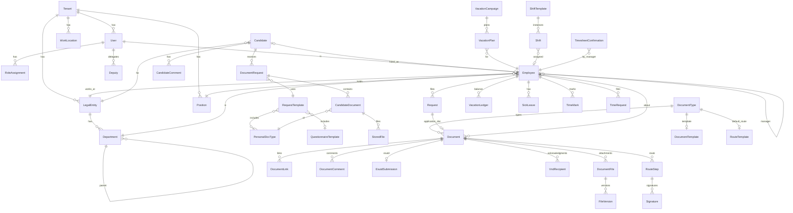

# ARCHITECTURE: Akere HR

## 1. Stack

| Layer | Choice | Why |
|-------|--------|-----|
| Language | **TypeScript** (strict) everywhere | One type system from DB to UI; shared validation schemas. |
| Monorepo | **pnpm workspaces** (`apps/web`, `apps/api`, `packages/shared`) | Clear ownership boundaries for parallel work; one install. |
| Frontend | **Next.js 15 (App Router) + React 19** | Mainstream, file-based routing for ~40 screens, PWA-capable, SSR for the shell. |
| UI | **Tailwind CSS 4 + Radix UI primitives** (shadcn-style components in-repo) | Accessible primitives (dialogs, popovers, selects) with our own design tokens; no heavy UI kit lock-in. |
| Data fetching | **TanStack Query** + typed API client | Caching, pagination, optimistic updates, loading/error states by default. |
| Tables | **TanStack Table** | Registries with filters, column visibility and multi-select (F-01, F-15, F-43). |
| i18n | **next-intl** (RU default, KZ, EN) | Locale routing + ICU messages; works with server components. |
| Backend | **Fastify 5** (Node 22) | Fast and well documented, with first-class schema validation, rate-limit, multipart and cookie plugins. Separate from Next so background jobs and the public API (F-50) live in one long-running process. |
| Validation | **Zod** (in `packages/shared`) → Fastify via `fastify-type-provider-zod` | The same schemas validate requests on the server and forms on the client. |
| DB | **PostgreSQL 16** | Relational HR data, transactions for signing and numbering, JSONB for template fields, full-text search (`tsvector`) for documents. |
| ORM | **Prisma 6** | Typed queries, migrations, seed scripts. |
| Jobs | **pg-boss** (Postgres-backed queue) | Reminders, deadline checks, ЕСУТД submissions, emails without adding Redis. |
| Auth | **Own session auth**: argon2id password hashes, opaque session tokens in httpOnly `SameSite=Lax` cookies stored hashed in DB, OTP codes (email/SMS/WhatsApp) | Needed for OTP + password + candidate OTP-only portal (M2); no third-party lock-in; SSO via adapter. |
| CSRF | SameSite=Lax cookies + mandatory `X-Requested-With`/Origin check on mutating requests | Same-origin app via Next rewrites; header check blocks cross-site form posts. |
| File storage | **S3 API** (`@aws-sdk/client-s3`); **MinIO** in Docker; local-disk driver for dev/tests | Cloud-ready and on-prem-ready (M2 offers on-prem). |
| PDF | **pdf-lib** + embedded Noto Sans (Cyrillic + Kazakh glyphs) | Pure JS generation of contracts/orders/signature sheets; no headless browser in production. |
| Spreadsheets | **exceljs** | Candidate import template (F-03), T-13 export (F-43), sheets. |
| QR | **qrcode** | eGov-style QR signing UX (sandbox). |
| Email | **nodemailer** → SMTP; **Mailpit** in Docker for dev | Real SMTP in production by env vars; dev mailbox UI. |
| Real-time | None (polling via TanStack Query `refetchInterval` on the "Today" board) | The only live screen is the timesheet board; polling every 30 s is enough and avoids websockets infra. |
| Tests | **Vitest** (unit + API integration against a real Postgres test DB), **Playwright** (E2E) | Mainstream; Chromium is preinstalled in CI image. |
| Hosting | **Docker Compose**: `web`, `api`, `postgres`, `minio`, `mailpit` | One command locally; same images on a VPS/on-prem; swap to managed Postgres/S3 by env. |

## 2. Folder structure

```
akere/
├─ apps/
│  ├─ api/                         # Fastify backend (owner: Backend agent)
│  │  ├─ prisma/
│  │  │  ├─ schema.prisma          # single source of the data model
│  │  │  ├─ migrations/
│  │  │  └─ seed/                  # realistic KZ seed data
│  │  ├─ src/
│  │  │  ├─ app.ts                 # buildApp() — plugins, error handler, routes
│  │  │  ├─ server.ts              # listen + start job workers
│  │  │  ├─ config.ts              # env parsing (zod)
│  │  │  ├─ lib/                   # db, auth/session, permissions, errors, pagination, crypto, pdf, numbering
│  │  │  ├─ adapters/              # third-party interfaces + sandbox implementations
│  │  │  │  ├─ messaging/          # email | sms | whatsapp
│  │  │  │  ├─ storage/            # s3 | local
│  │  │  │  ├─ signing/            # egov-mobile | egov-business | ncalayer (sandbox crypto)
│  │  │  │  ├─ personal-file/      # "Цифровое личное дело" (sandbox generator)
│  │  │  │  ├─ esutd/              # Enbek ЕСУТД (sandbox)
│  │  │  │  ├─ face/               # selfie verification (sandbox)
│  │  │  │  └─ sso/                # AD/OIDC (stub interface; KNOWN_GAPS)
│  │  │  ├─ modules/<module>/      # routes.ts (HTTP) + service.ts (business logic)
│  │  │  └─ jobs/                  # pg-boss handlers (reminders, deadlines, esutd)
│  │  └─ test/                     # vitest integration tests (real DB)
│  └─ web/                         # Next.js frontend (owner: Frontend + Design agents)
│     ├─ src/app/[locale]/
│     │  ├─ (auth)/login, reset
│     │  ├─ (app)/...              # HR / manager / employee cabinets (role-aware nav)
│     │  └─ portal/...             # candidate portal (OTP)
│     ├─ src/components/ui/        # design system (owner: Design agent)
│     ├─ src/components/<domain>/  # feature components
│     ├─ src/lib/api/              # typed API client (shared file: one agent at a time)
│     ├─ messages/{ru,kk,en}.json  # translations
│     └─ e2e/                      # Playwright
├─ packages/shared/                # zod schemas, enums, permission matrix, types (shared: one agent at a time)
├─ docker-compose.yml, Dockerfile.api, Dockerfile.web
└─ SPEC.md, ARCHITECTURE.md, API.md, PROGRESS.md, KNOWN_GAPS.md, README.md
```

## 3. Data model (ERD)

The full schema is in `apps/api/prisma/schema.prisma`. Every tenant-owned table carries
`tenantId` (indexed), and every query goes through a tenant-scoped helper.



Key modelling decisions:
- **Document** is the universal e-document (contract, order, application, ВНД, archive item). The `kind` and `DocumentType` drive behaviour; JSONB `data` holds template variables.
- **RouteStep** is instantiated per document from a `RouteTemplate` (ordered steps with `action` = APPROVE | SIGN | ACKNOWLEDGE, `assigneeRule` = ROLE | MANAGER_OF_SUBJECT | SUBJECT | SIGNATORY | USER). The steps are copied onto the document so later template edits never rewrite history.
- **Vacation balance** is a ledger (`VacationLedger`: accrual, usage, adjustment rows) instead of a mutable counter, so it is auditable and recomputable.
- **TimeMark** stores raw events (IN, BREAK_START, BREAK_END, OUT) with selfie file + geo + verification result. Daily worked time, statuses and the T-13 grid are **computed** from shifts, marks, absences and the production calendar, not stored.
- **NumberSequence** (per tenant + legal entity + document type + year) incremented inside the same transaction as registration → no duplicate numbers.
- **StoredFile** holds metadata (key, mime, size, sha256); the bytes live in S3/local storage. Upload checks: mime sniffing (magic bytes), extension allow-list, size limits.

## 4. Auth and permissions model

- **Staff users** log in with email/phone + password; if the tenant enables 2FA, an OTP is sent to the user's channel. Sessions are random 32-byte tokens; only the SHA-256 hash is stored. Cookie `akere_session`, httpOnly, SameSite=Lax, Secure in production, 12 h sliding expiry.
- **Candidates** log in on `/portal` with an OTP sent to their contact channel; the session has `subjectType=CANDIDATE` and can only reach `/portal/*` endpoints for their own request.
- **Rate limiting**: global 300 req/min per IP; auth/OTP endpoints 5 attempts per 15 min per identifier + IP; OTP codes are 6 digits, hashed, 10-minute TTL, 5 attempts max.
- **RBAC**: `packages/shared/src/permissions.ts` defines permission keys (e.g. `candidate.read`, `document.sign`, `timesheet.manage`) → roles (ADMIN, HR, MANAGER, EMPLOYEE). Each route declares `requirePermission(...)`.
- **Row scoping** (rules): HR is scoped to assigned legal entities (empty = all); MANAGER is scoped to the subtree of employees whose `managerId` chain leads to them; EMPLOYEE only to self. Implemented as Prisma `where` builders in `lib/scope.ts`, applied in services (and covered by tests).
- **Signing authority**: `RoleAssignment.canSignForLegalEntity` determines who resolves the SIGNATORY route rule.
- **Deputies**: when a step is assigned to user X and X has an active deputy Y, both can act; the signature records `onBehalfOfId = X`. Exception: ACKNOWLEDGE steps (personal acknowledgment of orders and ВНД) can only be completed by the assignee personally.
- **Concurrency**: route transitions lock the document row (`SELECT … FOR UPDATE`) and claim steps with conditional updates; request submission takes a per-employee advisory lock (no vacation double-spend); login attempts and OTP attempts are counted atomically.

## 5. Third-party adapters

Each adapter is an interface in `src/adapters/<name>/index.ts` with a `sandbox` implementation
and (where possible) a `real` implementation selected by env. Sandbox implementations are fully
working for demos and tests, and they are named "sandbox" in the UI (a banner "Sandbox mode" on
signing/ЕСУТД screens), so nothing is faked silently.

| Adapter | Interface | Sandbox behaviour | Real implementation |
|---------|-----------|-------------------|---------------------|
| `messaging.email` | `send({to, subject, html, text})` | SMTP to Mailpit (Docker) or the `Outbox` table in tests | SMTP (any provider) by env: **ready** |
| `messaging.sms` | `send({to, text})` | Writes to the `Outbox` table, visible in Admin → Outbox | Provider (e.g. Mobizon/SMSC.kz): **needs credentials** (KNOWN_GAPS) |
| `messaging.whatsapp` | `send({to, template, params})` | Same as SMS | WhatsApp Business API: **needs credentials** |
| `storage` | `put/get/delete/presign` | Local disk (`./data/files`) or MinIO | AWS S3 / any S3: **ready** by env |
| `personalFile` | `requestConsent(iin, phone)`, `fetch(iin) → documents[]` | Consent auto-confirms after the user types `511` in a simulated SMS dialog; returns deterministic realistic data (from ИИН seed) + a generated "Личные данные" PDF | Цифровое личное дело (via eGov/mGov): **needs accreditation** |
| `signing` | `createSession(docIds, signer, method) → {qr, sessionId}`, `complete(sessionId)`, `verify(signature)` | ECDSA P-256 key per user (private key AES-256-GCM encrypted with `SIGNING_MASTER_KEY`); QR opens `/sign/<session>` (in-app "eGov mobile sandbox" page) to confirm; real signature over the SHA-256 of the PDF | eGov mobile QR / NCALayer (CMS/GOST): **needs НУЦ integration** |
| `esutd` | `submit(contract) → {externalId}`, `status(id)` | Validates required fields, returns ids after a delay via job, 5% simulated rejection with a reason for testing | Enbek ЕСУТД API: **needs access** |
| `face` | `verify(selfie, referencePhoto?) → {passed, score}` | Checks that the image is a real JPEG/PNG of reasonable size, then passes; flags if the reference photo is missing | Biometric provider: **needs vendor** |
| `sso` | `authorizeUrl()`, `callback()` | Not enabled (button hidden) | OIDC/AD: **needs config** |

## 6. Phase plan

| Phase | Name | Ends with (testable state) |
|-------|------|----------------------------|
| **P1** | Foundation | Monorepo, schema + migrations, seed, auth (password, OTP, reset, rate limit), tenants/legal entities/departments/positions/locations, users & roles, app shell with role-aware nav, design system, i18n RU/KZ/EN, audit log, notification center, messaging/storage adapters, demo user switcher. |
| **P2** | Candidate onboarding (core value) | HR creates/imports candidates, builds request & questionnaire templates, sends requests; candidate portal with OTP, upload, auto-fill via personal-file sandbox; HR review; statuses; comments; hire → employee; 1С export API/file. |
| **P3** | Documents & e-signing | Document templates → PDF; registry (inbox/outbox/drafts/all, search, filters); document card (preview, attachments with versions, links, comments); configurable routes; sandbox signing (eGov mobile/Business QR, NCALayer); deputies; mass sign/approve; numbering incl. manual/backdated/paper; deadlines + reminders; email notifications; employee e-dossier; HR events hire/transfer/dismissal generate documents. |
| **P4** | Requests & vacations | Request templates (vacation, unpaid, business trip…), request form with balance, full route Manager → HR → order → signing; vacation ledger; vacation schedule campaign with planning, bulk approval, grid, reminders. |
| **P5** | ВНД, ЕСУТД, archive, sick leaves, reports, API | ВНД acknowledgments; ЕСУТД registry + bulk submit; archive bulk upload; sick leaves; analytics dashboard + reports; public API keys; help page. |
| **P6** | Time tracking | Shift templates, patterns, planning grid + publish, open shifts; My time with selfie+geo clock in/out, breaks; requests (correction, day-off work); Today board; marks; T-13 grid with codes, confirmations, Excel export. |
| **P7** | Polish & release | PWA manifest + service worker, accessibility pass, performance (indexes, N+1 audit), Docker images + compose, README with screenshots, full feature walkthrough. |

## 7. Traceability

| Feature | Phase | Feature | Phase | Feature | Phase |
|---------|-------|---------|-------|---------|-------|
| F-01 | P2 | F-18 | P3 | F-35 | P5 |
| F-02 | P2 | F-19 | P3 | F-36 | P5 |
| F-03 | P2 | F-20 | P3 | F-37 | P6 |
| F-04 | P2 | F-21 | P3 | F-38 | P6 |
| F-05 | P2 | F-22 | P3 | F-39 | P6 |
| F-06 | P2 | F-23 | P3 (infra P1) | F-40 | P6 |
| F-07 | P2 | F-24 | P5 | F-41 | P6 |
| F-08 | P2 | F-25 | P5 | F-42 | P6 |
| F-09 | P2 | F-26 | P4 | F-43 | P6 |
| F-10 | P2 | F-27 | P4 | F-44 | P1 |
| F-11 | P2 | F-28 | P4 | F-45 | P1 |
| F-12 | P2 (docs in P3) | F-29 | P3 | F-46 | P1 (strings grow each phase) |
| F-13 | P2 | F-30 | P3 | F-47 | P1 → P7 (PWA) |
| F-14 | P3 | F-31 | P1 | F-48 | P5 |
| F-15 | P3 | F-32 | P1 | F-49 | P1 (email) / P2 (SMS, WhatsApp) |
| F-16 | P3 | F-33 | P4 | F-50 | P5 |
| F-17 | P3 | F-34 | P5 | A-01…A-05 | P1 |

No orphan features: all 50 feature IDs and 5 additions are mapped.

## 8. Agent ownership (parallel work)

| Agent | Owns | Must not edit |
|-------|------|---------------|
| Backend | `apps/api/**` except `prisma/schema.prisma` when another agent holds it | `apps/web/**` |
| Frontend | `apps/web/src/app/**`, `apps/web/src/components/<domain>/**`, `apps/web/messages/**` | `apps/api/**`, `components/ui/**` |
| Design | `apps/web/src/components/ui/**`, `apps/web/src/styles/**`, Tailwind config | API, pages |
| QA | `apps/api/test/**`, `apps/web/e2e/**` | product code (files bugs instead) |
| Review | read-only; writes findings into PROGRESS.md | — |

Shared files (`packages/shared/**`, `apps/api/prisma/schema.prisma`, `apps/web/src/lib/api/**`,
`API.md`) are changed by the lead (me) or by one agent explicitly handed the lock for that phase.
Contract changes go to API.md first.
