# Akere HR

Electronic HR document management (КЭДО) for companies in Kazakhstan. It covers the full cycle from hiring to dismissal:
candidate onboarding with automatic document collection, e-signing of HR documents through configurable
approval routes, employee self-service requests, vacation planning, acknowledgment of internal regulations
(ВНД), labour-contract registration with ЕСУТД, and time tracking with shift planning and the T-13 timesheet.

> Portfolio project. Government and third-party integrations (eGov, NCALayer, ЕСУТД, Цифровое личное дело,
> SMS/WhatsApp, 1С) run as **clearly labelled sandbox adapters** with real behaviour (for example, real cryptographic
> signatures that can be verified) and a defined interface for the live implementation. See [KNOWN_GAPS.md](KNOWN_GAPS.md).

## Highlights

- **Three cabinets**: HR, manager, employee (plus a candidate portal), each with permissions and data scoped by role.
- **Onboarding in minutes**: HR sends a document request by email, SMS or WhatsApp. The candidate logs in with a one-time code,
  pulls their documents from the government "Цифровое личное дело" in one tap (sandbox), and HR reviews and hires.
  The employee record, hire order and employment contract are created automatically.
- **Route engine**: sequential and parallel approve/sign/acknowledge steps, deputies, return for rework, deadlines with reminders,
  auto-numbering (manual and backdated numbers too), paper-signed fallback, and versioned attachments.
- **E-signing (sandbox)**: eGov mobile / eGov mobile Business QR flow and NCALayer PIN flow. Each signature is ECDSA P-256
  over the document's SHA-256, stored with the public key, verifiable, and printed on a signature sheet.
- **Time tracking**: shift templates and patterns (5/2, 2/2), a planning grid, clock-in with selfie and geofence,
  a live "today" board, and the T-13 timesheet with KZ codes and Excel export for 1С.
- **Kazakhstan specifics**: ИИН/БИН checksum validation, the production calendar with holiday carry-over, 24-day annual leave
  and the 14-day part rule, Labor Code overtime rates, and RU/KZ/EN interface.

## Screenshots

| | |
|---|---|
| 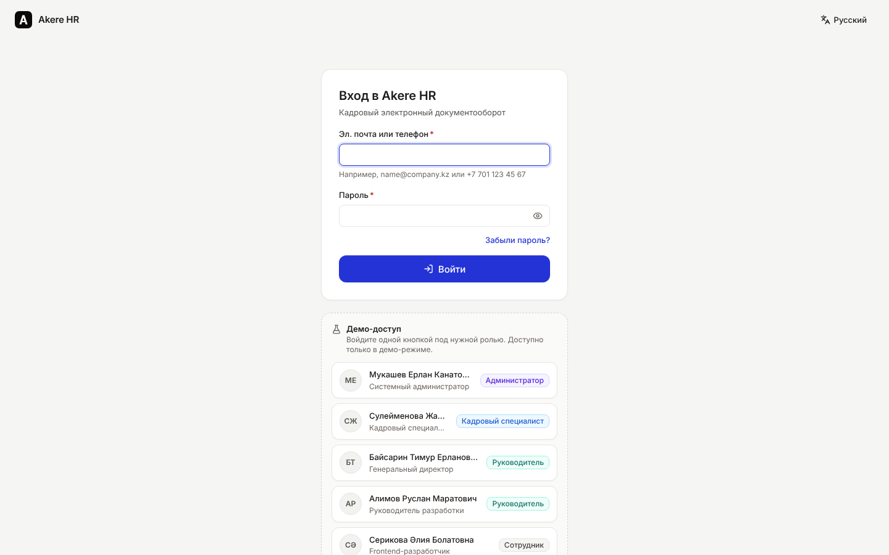 Login with one-click demo accounts | 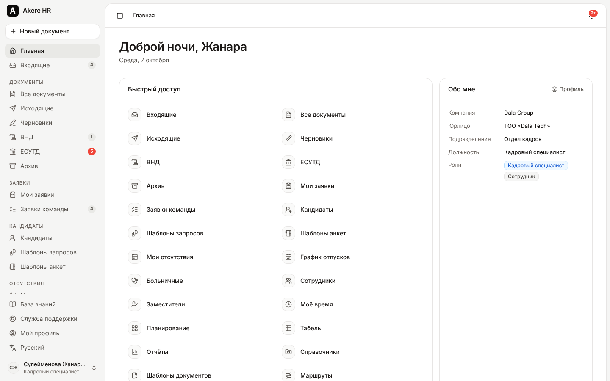 HR cabinet home |
| 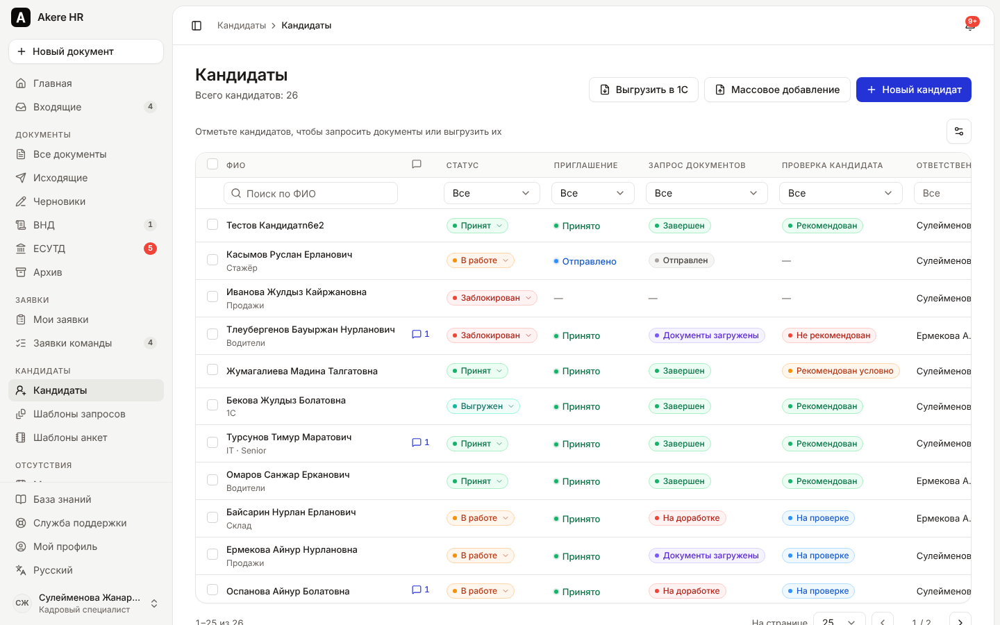 Candidate registry (onboarding) | 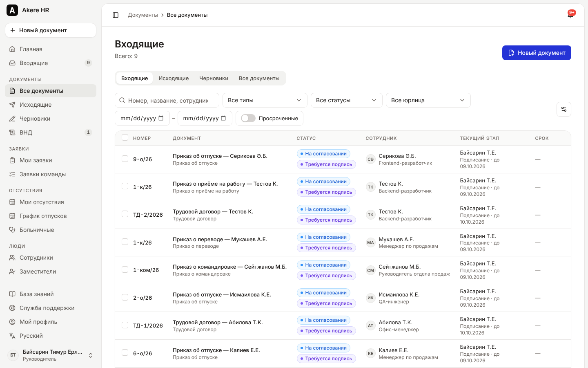 Document inbox of the CEO |
| 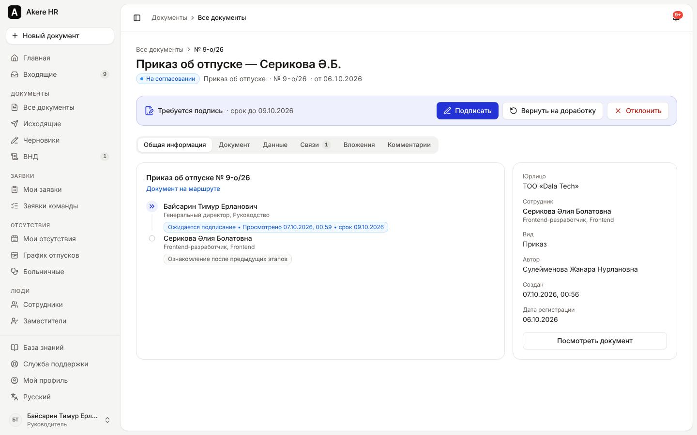 Document card with route and signing actions | 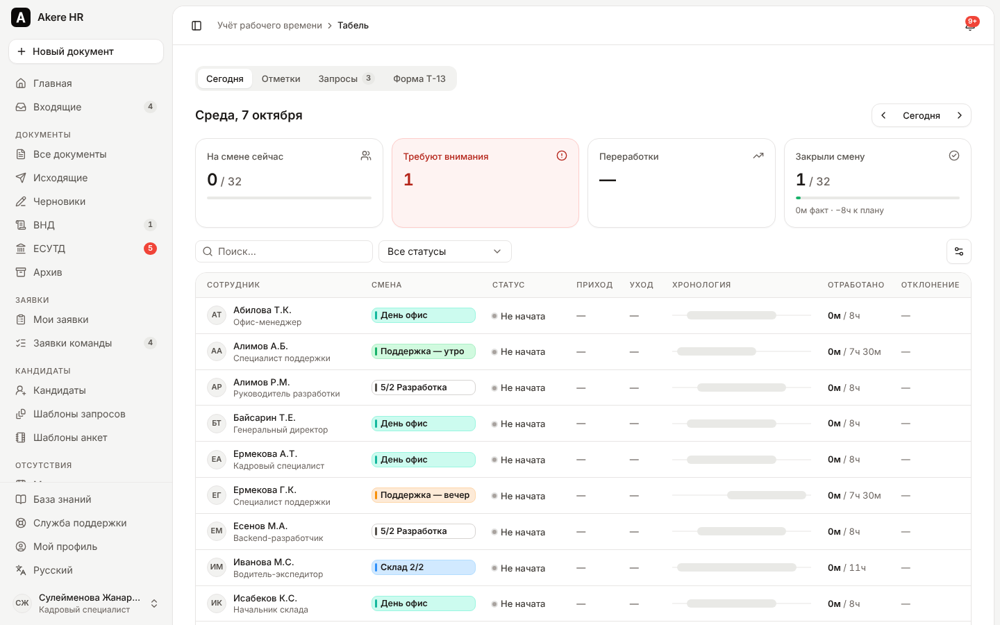 Timesheet: today board |
| 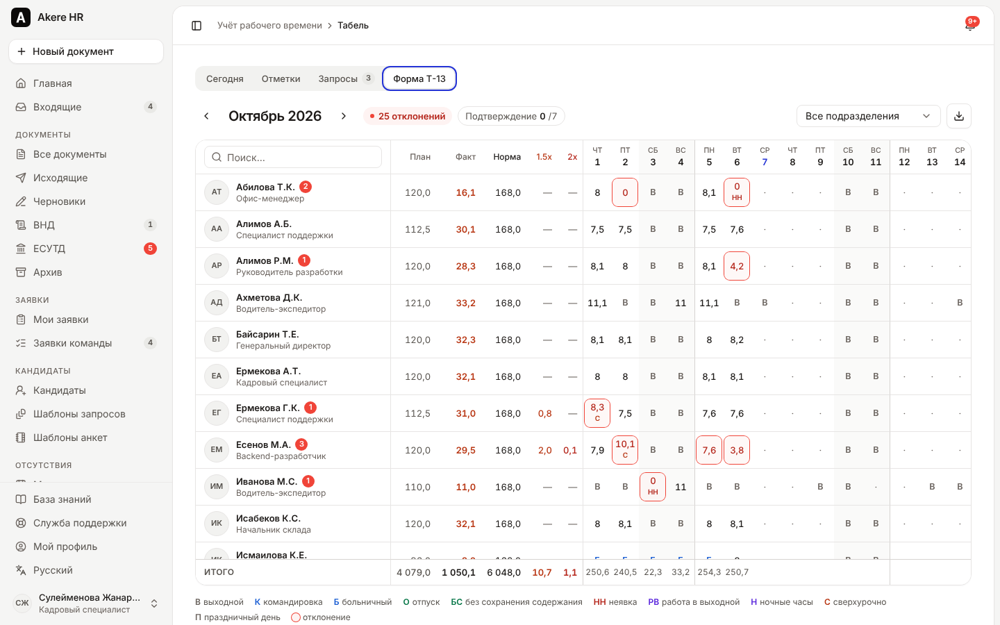 T-13 timesheet with KZ codes and deviations | 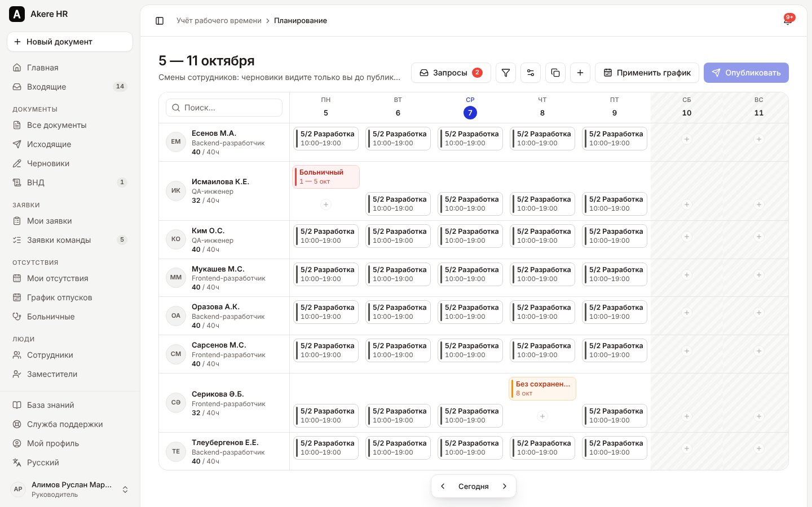 Shift planning grid (manager) |
| 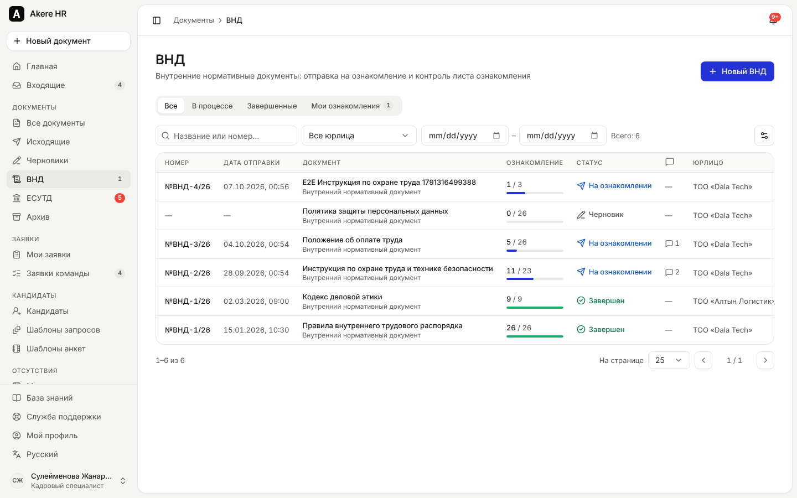 ВНД acknowledgment registry | 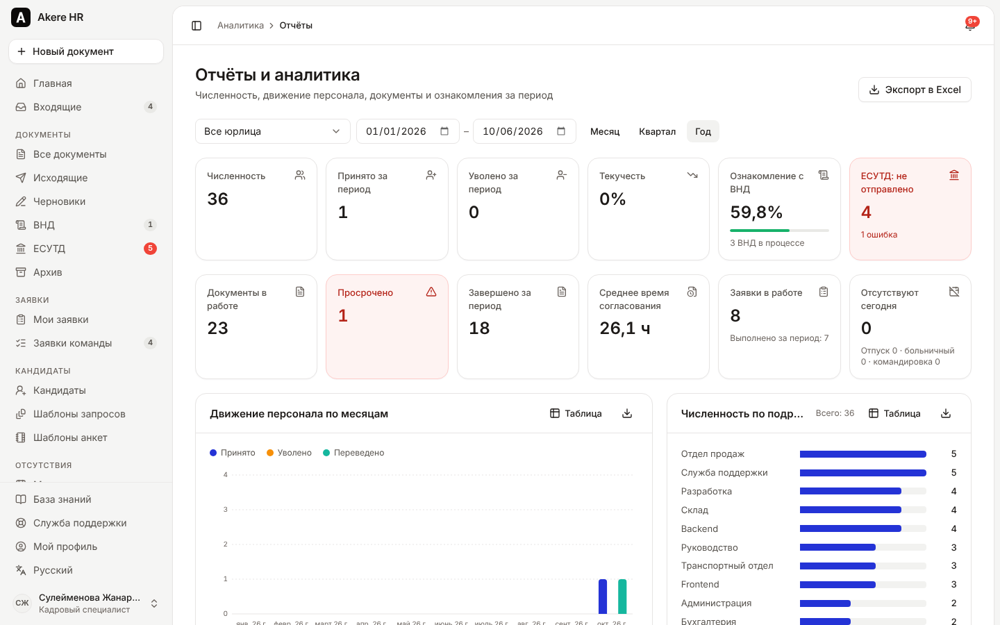 Analytics and reports |
| 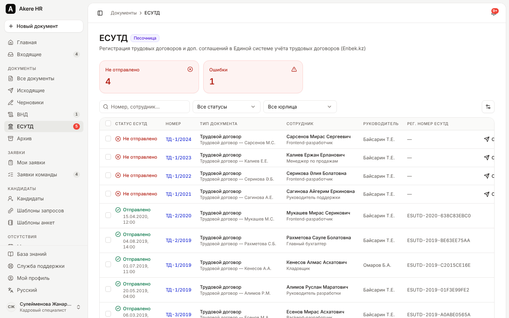 ЕСУТД registry (sandbox) | 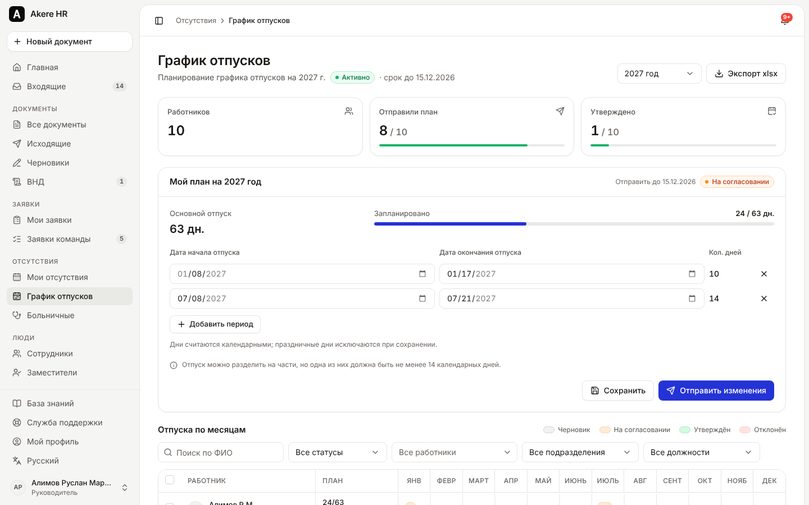 Vacation schedule campaign |

<p>
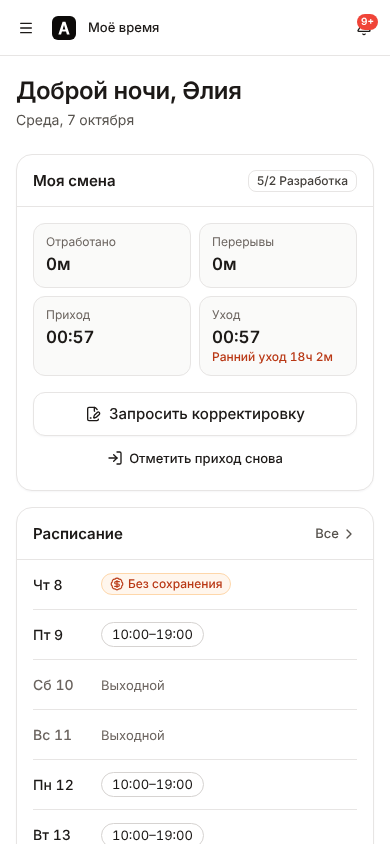
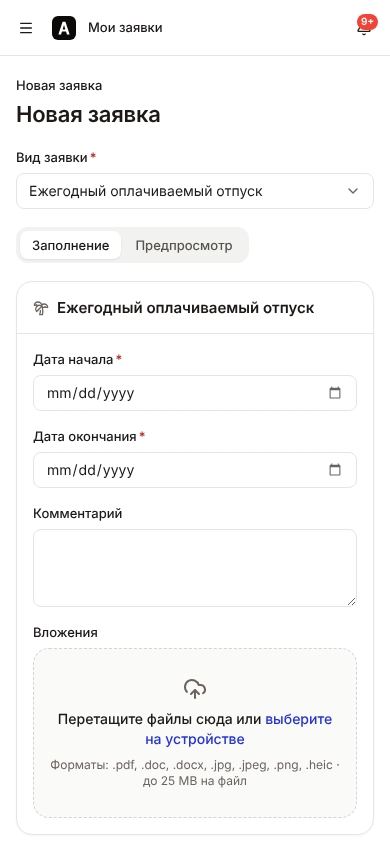
</p>

Regenerate with `node apps/web/e2e/capture-screens.mjs http://localhost:3000` against a seeded instance.

## Stack

| Layer | Tech |
|-------|------|
| Frontend | Next.js 15 (App Router), React 19, TypeScript, Tailwind CSS 4, Radix UI, TanStack Query/Table, next-intl, PWA |
| Backend | Fastify 5, TypeScript, Zod, Prisma 6, PostgreSQL 16, pg-boss jobs |
| Files & docs | S3/MinIO (or local disk), pdf-lib + Noto Sans (Cyrillic + Kazakh), exceljs, qrcode |
| Security | argon2id, httpOnly session cookies, OTP 2FA, CSRF header check, rate limits + lockout, magic-byte upload checks, row-level scoping, audit log |
| Tests | Vitest (API integration against real Postgres, web unit), Playwright (E2E) |
| Deploy | Docker Compose: web, api, postgres, minio, mailpit |

## Quick start (Docker)

```bash
cp .env.example .env && echo "SIGNING_MASTER_KEY=$(openssl rand -hex 32)" > .env
docker compose up --build -d
docker compose run --rm -e SEED_FORCE=true api pnpm exec tsx prisma/seed/index.ts   # demo data
```

Open http://localhost:3000. The login page lists one-click demo accounts (`DEMO_MODE=true`). The password for every demo account is `Akere2026demo`.
Sandbox email: http://localhost:8025 (Mailpit). Sandbox SMS/WhatsApp: Admin → Outbox.

| Demo account | Role |
|--------------|------|
| admin@dala.kz | Administrator |
| hr@dala.kz | HR specialist |
| ceo@dala.kz | CEO, signatory |
| r.alimov@dala.kz | Head of development (manager) |
| a.serikova@dala.kz | Frontend developer (employee) |

## Local development

Requires Node 22, pnpm 10 and PostgreSQL 16.

```bash
pnpm install
createdb akere   # user/password akere:akere, or change DATABASE_URL
cp apps/api/.env.example apps/api/.env   # set SIGNING_MASTER_KEY=$(openssl rand -hex 32)
pnpm db:migrate
pnpm db:seed
pnpm dev          # API on :4000, web on :3000
```

Tests:

```bash
createdb akere_test
pnpm --filter @akere/api test      # API integration tests (real Postgres)
pnpm --filter @akere/web test      # web unit tests
pnpm --filter @akere/web exec playwright test   # E2E (needs both servers running)
```

## Architecture

- `apps/api`: Fastify modules (`src/modules/<module>/routes.ts` + service), adapters for every third-party integration (`src/adapters`), domain events between modules (`src/lib/hooks.ts`), and jobs (`src/jobs`).
- `apps/web`: Next.js App Router with locale-prefixed routes, a design system in `src/components/ui`, and a typed API client in `src/lib/api`.
- `packages/shared`: Zod schemas, permission matrix and validators shared by both apps.

Full details: [ARCHITECTURE.md](ARCHITECTURE.md) (stack rationale, ERD, auth model, phases), [API.md](API.md) (contract),
[SPEC.md](SPEC.md) (50 features with sources), [KNOWN_GAPS.md](KNOWN_GAPS.md) (what needs real credentials).

## Features

See SPEC.md for the full list (F-01…F-50). Verification status of each feature is tracked in [PROGRESS.md](PROGRESS.md).

## Roadmap

1. Live integrations: НУЦ РК / eGov QR signing, ЕСУТД API, SMS provider, WhatsApp Business.
2. 1С external processing (BSL) that consumes `/api/v1/public/*`.
3. Native mobile app wrapping the PWA (push notifications for signing).
4. Biometric face match against the ID photo for clock-in.
